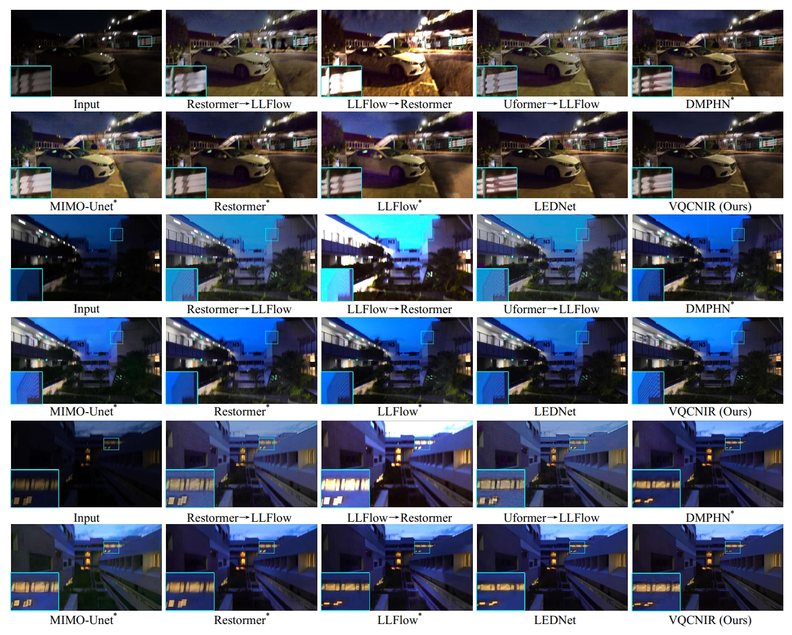

# AAAI'24 VQCNIR: Clearer Night Image Restoration with Vector-Quantized Codebook

This is the office implementation of ***VQCNIR: Clearer Night Image Restoration with Vector-Quantized Codebook, AAAI2024.***

<a href="https://alexzou14.github.io">Wenbin Zou*,</a> Hongxia Gao <sup>✉️</sup>, 
<a href="https://owen718.github.io">Tian Ye,</a> Liang Chen, Weipeng Yang, Shasha Huang, Hongshen Chen, 
<a href="https://ephemeral182.github.io">Sixiang Chen</a>
<br>

***SCUT｜ HKUST(GZ)｜FJNU***

[](https://arxiv.org/pdf/2312.08606)
[](Figures/VQCNIR_supp.pdf)


<hr />


> **Abstract:** *Night photography often struggles with challenges like low light and blurring, stemming from dark environments and prolonged exposures. Current methods either disregard priors and directly fitting end-to-end networks, leading to inconsistent illumination, or rely on unreliable handcrafted priors to constrain the network, thereby bringing the greater error to the final result. We believe in the strength of data-driven high-quality priors and strive to offer a reliable and consistent prior, circumventing the restrictions of manual priors.
In this paper, we propose Clearer Night Image Restoration with Vector-Quantized Codebook (VQCNIR) to achieve remarkable and consistent restoration outcomes on real-world and synthetic benchmarks. To ensure the faithful restoration of details and illumination, we propose the incorporation of two essential modules: the Adaptive Illumination Enhancement Module (AIEM) and the Deformable Bi-directional Cross-Attention (DBCA) module. The AIEM leverages the inter-channel correlation of features to dynamically maintain illumination consistency between degraded features and high-quality codebook features. Meanwhile, the DBCA module effectively integrates texture and structural information through bi-directional cross-attention and deformable convolution, resulting in enhanced fine-grained detail and structural fidelity across parallel decoders.Extensive experiments validate the remarkable benefits of VQCNIR in enhancing image quality under low-light conditions, showcasing its state-of-the-art performance on both synthetic and real-world datasets.* 

<hr />


## TODO List
- [x] Testing Code&Checkpoint
- [x] Model.py
- [ ] Train.py

## Installation
Our VQCNIR is built in Pytorch1.12.0, we train and test it ion Ubuntu20.04 environment (Python3.8, cuda11.3).
For installing, please follow these intructions.

```
conda create -n vqcnir python=3.8
conda activate vqcnir
conda install pytorch=1.12 
pip install opencv-python ....
```

## Dataset
:open_file_folder: We train and test our LEDNet in LOL-Blur, RealLOL-Blur benchmarks. The download links of datasets are provided.(The datasets are hosted on both Google Drive and BaiduPan) 

| Dataset | Link | Number | Description|
| :----- | :--: | :----: | :---- | 
| LOL-Blur | [Google Drive](https://drive.google.com/drive/folders/11HcsiHNvM7JUlbuHIniREdQ2peDUhtwX?usp=sharing) / [BaiduPan (key: dz6u)](https://pan.baidu.com/s/1CPphxCKQJa_iJAGD6YACuA) | 12,000 | A total of 170 videos for training and 30 videos for testing, each of which has 60 frames, amounting to 12,000 paired data. (Note that the first and last 30 frames of each video are NOT consecutive, and their darknesses are simulated differently as well.)|
| Real-LOL-Blur| [Google Drive](https://drive.google.com/drive/folders/1fXUA5SzXj46ISw9aUjSors1u6M9VlKAn?usp=sharing) / [BaiduPan (key: fh32)](https://pan.baidu.com/s/1sP87VGiof_NixZsA8dhalA) | 1354 | 482 real-world night blurry images (from [RealBlur-J Dataset](http://cg.postech.ac.kr/research/realblur/)) + 872 real-world night blurry images acquired by Sony RX10 IV camera.|

## Inference Stage
**You can download the model weights:** [Google Drive](https://drive.google.com/file/d/1bqGF7ee93ViI0V0uwlDU008QinGFWSRP/view?usp=drive_link), [BaiduYun(code:ALEX)](https://pan.baidu.com/s/1vQOhjLYuctqA5wI-1pYrjw?pwd=ALEX)

Run the following commands:
```
python3  inference_vqlol.py -i dataset_path -w model_weight  -o output_dir 
```

## More Results



## Contact
**Wenbin Zou: alexzou14@foxmail.com** 

## Acknowledgement

This project is based on [BasicSR](https://github.com/XPixelGroup/BasicSR) and [FeMaSR](https://github.com/chaofengc/FeMaSR). We calculate evaluation metrics using [IQA-PyTorch](https://github.com/chaofengc/IQA-PyTorch) toolbox. Thanks for their awesome works.

## Citation
```bibtex
@article{zou2023vqcnir,
  title={VQCNIR: Clearer Night Image Restoration with Vector-Quantized Codebook},
  author={Zou, Wenbin and Gao, Hongxia and Ye, Tian and Chen, Liang and Yang, Weipeng and Huang, Shasha and Chen, Hongsheng and Chen, Sixiang},
  journal={arXiv preprint arXiv:2312.08606},
  year={2023}
}
```
